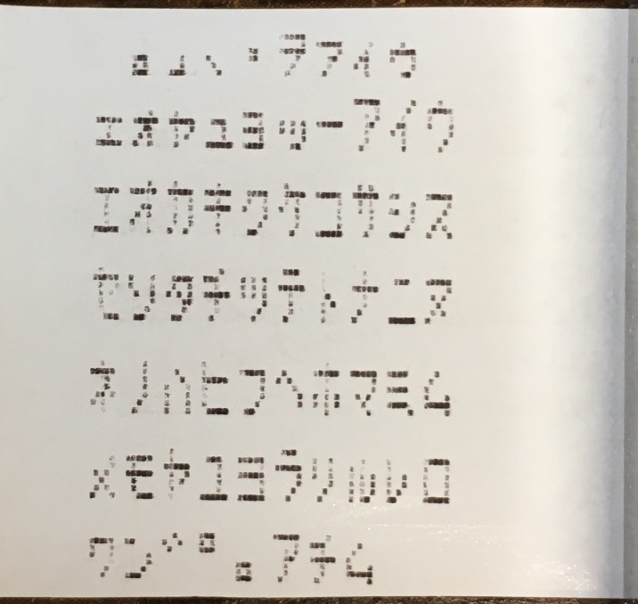
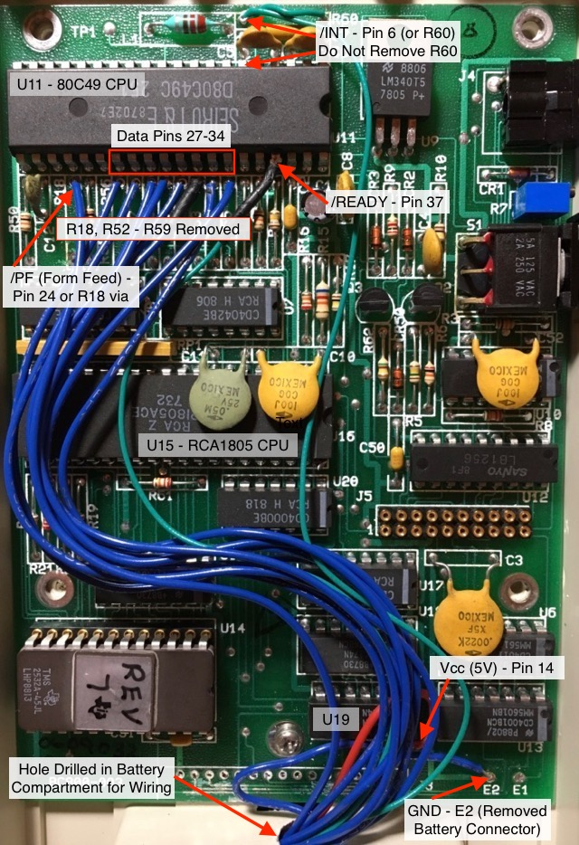
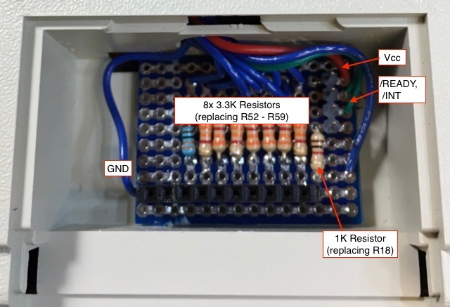
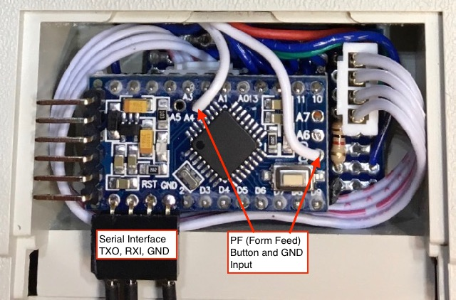
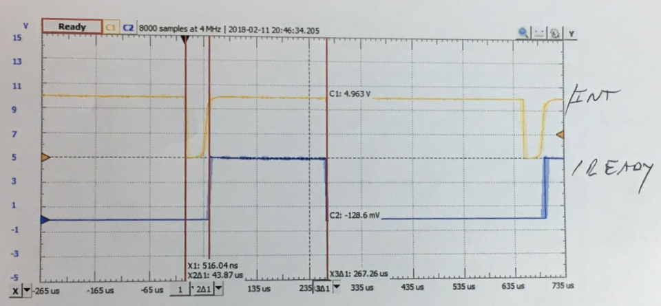
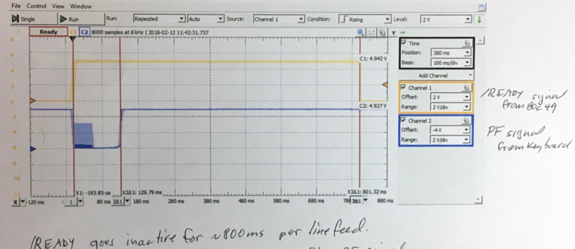

# BoydPrinter Library

This library is designed to work with the Seiko MTP-120 thermal printer
that is part of the "Boyd Dimension Calculator". It will only work with
a modified version of the calculator as described below.

The  calculator's main CPU is an RCA 1805 which interfaces with a Seiko
80C49 CPU and associated driver circuitry to control the thermal printer.
This library allows bypassing the 1805 chip to control the printer
through the 80C49.

The calculator was developed in the 1980s (the printer in my calculator
has a 1988 date code), and a small quantity was available for purchase
from [BG Micro](http://www.bgmicro.com) in early 2017.

Although my main interest in the calculator was for its Siemens DL440 "bubble"
LEDs and the thermal printer, other [hobbyists](https://groups.io/g/cosmacelf/topic/30342705)
were interested in the RCA 1805 CPU -- a successor to the [1802 chip](https://en.wikipedia.org/wiki/RCA_1802).

Based on some very interesting reverse-engineering by the 1805 enthusiasts,
I was able to determine the hardware and software interfacing required to
bypass the 1805 and use a (more easily programmed) Arduino to control the
printer.

This library was designed to work with 5V Arduino boards; however, there is
nothing platform-specific to the code. It should therefore also run on
3.3V Arduino variants and MSP430 chips if additional interfacing is done to
deal with 5V<->3.3V level-shifing. In fact, level-shifting should not be
required at all if using the "ignore /READY signal" configuration, since the
output lines at 3.3V should be sufficient to indicate a high level to the 80C49.

## Usage

Use the constructor to set up the pins used to interface with the calculator.
A total of 10 output pins and 1 input pin are required. For example,

    BoydPrinter myPrinter(2, 3, 4, 5, 6, 7, 8, 9, 15, 16, 14);

The first 8 parameters correspond to output data lines D0 - D7. The final
three parameters, in order, are: /INT (interrupt) output pin, PF (form feed) output pin, and
/READY input pin.

It is possible to use one less I/O pin by ignoring the /READY pin. This pin is
an input to the Arduino and signals that the 80C49 is ready to receive
printer data. When ignoring this pin, the library adds delays to ensure that the data is properly transferred to the printer. To operate the printer in this manner, call the constructor with 10 parameters instead of 11 (i.e., leave out the READY pin value):

    BoydPrinter myPrinter(2, 3, 4, 5, 6, 7, 8, 9, 15, 16);

Once you have created a BoydPrinter object, the following methods can be
used to control the printer:

    int println(char* s)
  Prints the null-terminated string pointed to by `s`.
  A maximum of 13 characters are printed, regardless of the actual length of the string. Any characters after the first 13 are ignored. The function returns the actual number of characters printed (not including the null terminator).

    void print(char c);
  Sends a single character to the printer. This does not automatically cause the character to print, since the printer only prints when it has received 13 characters to fill the line, or if it receives a carriage return -- see `printcr()` below.

    void printcr();
  Sends a carriage return to the printer. This prints any characters currently in the print buffer, advances the paper, and returns the print head to its home position.

    void printff();
  Sends a form feed to the printer. This advances the paper and returns the print head to its home position without printing any characters. **It does not clear the print buffer.** There was a dedicated "PF" key on the calculator to perform this function. It may be desirable to implement a dedicated key on the Arduino controller as well, since this function is used to advance the paper when loading a new paper roll.

    void cancelprint();
  Clears the print buffer, but does not advance the paper or move the print head. This command would typically be used to clear out characters previously sent with `print()` without printing them.

  The sketch in the `examples` folder uses all of the above functions, and also demonstrates how to use an external PF (Form Feed) button and a serial data interface to send characters to the printer.

## Character Set

The printer supports the standard ASCII character set for values 0x20 - 0x7E.
Control characters 0x0D (carriage return) and 0x18 (cancel) are also supported.
In addition, an extended character set from 0xA0 - 0xDF is available and prints
per the character map as shown here: .

## Hardware Pin Configuration

The calculator requires multiple hardware modifications in order to interface with the Arduino. Also refer to the [photo](extras/jpg/BoydWiring.jpg) and the Hardware Details section below.

+ Data Lines D0 - D7

   The data lines connect to pins 27-34 on U11 (80C49). Remove resistors R52-R59, solder wires into the resistor vias closest to the 80C49, and then place 3.3K series resistors on an [interface board](extras/jpg/InterfaceBoard.jpg) before connecting the Arduino. Alternatively, you can connect to the  Arduino through the existing 3.3K resistors. This can be done by clipping the far end of resistors R52-R59 and soldering the Arduino wires to the freed resistor legs.

   These series resistors are needed due to the internal buffer circuit on the "quasi-bidirectional" pins on Port 1 of the 80C49. Portions of the 80C49 firmware create a momentary low-impedance path to Vcc, at the same time that the Arduino may be trying to pull the data lines low. The 3.3K resistors limit the current to a safe level.

+ /INT (Interrupt) signal

   This connects to U11 pin 6. You can either solder directly to pin 6, or  solder a wire onto the R60 lead that is in line with pin 6. The other side of R60 is tied to +5V and ensures that /INT is inactive while the Arduino boots up and before it sets its digital pin to output mode. Do not remove R60.

+ /PF (Form Feed) signal

   Remove R18 (1K) and connect to the R18 via nearest to pin 24 of U11. Then use a series 1K resistor on the Arduino interface board, similar to Data Line signals described above. Alternatively, you can cut the end of R18 farther away from U11 and connect the Arduino I/O line to the resistor leg. In either case, make sure you have 1K series resistance between the Arduino output and pin 24 of U11.

+ /READY signal

   This connects to pin 37 of U11. This pin was left unconnected in the calculator, so there are no vias or other alternate connection points -- you need to carefully solder a wire to the pin.

+ Power (+5V)

   There are multiple points to connect to power; I chose pin 14 on U19.

+ Ground

   There are multiple points to connect GND. I chose to use the E2 via, previously connected to the 9V battery battery snap (which I removed).

### Pin Summary

     Boyd Printer        Arduino
     ---------------     -------
     U11, pins 27-34     Data output pins D0 - D7, through 3.3K series resistor.
     U11, pin 6          /INT (interrupt) output pin
     U11, pin 24         /PF (form feed) output pin, through 1K series resistor.
     U11, pin 37         /READY output pin (optional, see "Usage" section above)
     U19, pin 14         +5V Power. There are other board locations available.
     E2 via              GND. There are other board locations available.

## References

+ Hackaday [article](https://hackaday.com/2017/07/11/cosmac-elf-calculator-gets-new-firmware/#more-264530)
+ Groups.io discussion [group](https://groups.io/g/cosmacelf/topic/30342705)
+ Several articles on [Olduino](https://olduino.wordpress.com) blog: [programming](https://olduino.wordpress.com/2017/04/15/reprogramming-an-1805-based-calculator-in-c/), [printing](https://olduino.wordpress.com/2017/11/05/printing-on-the-boyd-calculator/), [LEDs](https://olduino.wordpress.com/2018/01/24/ugly-but-it-works-segment-addressing-on-the-boyd/)
+ [Pinouts, 80C49 disassembly and register usage](https://github.com/Tek4/COSMAC-Boyd-Calculator)

## Hardware Details

Hardware modifications to the main calculator controller board to interface to Arduino:

Interface board (mounted in battery compartment):

Connection to Pro Mini:

## Signal Timing

The following diagrams show the calculator signal timing between the 1805 and 80C49 -- this timing information was used to implement the Arduino library.

**/INT signal to /READY**: Approximately 43 us for /READY to go inactive once /INT is active, and a total of 267 us before /READY is active from when /INT is initially activated. Note, however, that the 80C49 activates /READY a short period of time before it is actually "ready". Since the ATmega chip on the Arduino runs significantly faster than the 1803, a slight additional delay was added to the Arduino library so that it does not send new data immediately after receiving a /READY signal. 

**/PF signal to /READY**: /READY goes inactive for about 800 ms after a form feed (/PF). Also note that it takes about 130 ms before /READY goes inactive after receiving a /PF signal. As noted above, /READY does not quite mean "ready", so the Arduino library has a brief delay after receiving a /READY before sending new data. 

## License

The software and other files in this repository are released under what is commonly called the [MIT License][100]. See the file [`LICENSE.txt`][101] in this repository.

[100]: https://choosealicense.com/licenses/mit/
[101]: ./LICENSE.txt
[102]: https://github.com/Andy4495
[200]: https://github.com/Andy4495/BoydPrinter/
